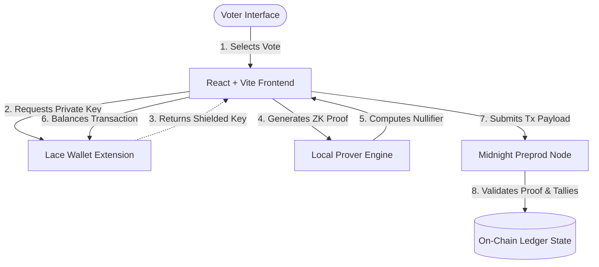

# Product Proposal: Midnight Private Voting

## 1. Problem Statement

Traditional online voting systems force a compromise between voter privacy and tally verifiability. 

In centralized systems, administrators control the database containing both the voter list and the cast ballots. This creates a single point of failure where database leaks, insider threats, or server compromises can link specific votes back to individual voters. 

On public, non-private blockchains, the ledger is completely transparent. While this solves the trust problem and makes tallies publicly verifiable, it compromises privacy because all transaction payloads and sender addresses are visible. Observers can easily correlate a voter's public wallet address with their vote option. This transparency exposes voters to:
* **Targeted Retribution & Coercion**: Authorities, employers, or community members can penalize individuals for voting against their interests.
* **Tracking Correlation**: Aggregated voting records allow observers to build profiles of users' political, economic, or corporate preferences.
* **Censorship**: Malicious nodes or network entities can selectively censor transactions containing vote selections they oppose.

---

## 2. Proposed Solution

**Midnight Private Voting** solves the online voting dilemma by combining blockchain transparency with zero-knowledge (ZK) cryptography. 

Built on the **Midnight Network**, the application utilizes **Compact** smart contracts to run local ZK circuits directly in the voter’s browser. This architecture decouples the voter's public blockchain address from their ballot. 

Voters generate a local cryptographic proof of eligibility and a deterministic **nullifier** in their browser. The nullifier acts as an anonymous tracking ID: it proves that this specific voter has cast a ballot in this specific election, but it hides *who* the voter is. 

The blockchain validates the ZK proof and verifies that the nullifier has not been used before. If valid, the contract registers the nullifier on the public ledger to prevent double voting and increments the public tally. This guarantees:
1. **Absolute Anonymity**: The ballot is logged without any link to the sender's shielded or unshielded wallet address.
2. **Public Verifiability**: Anyone can verify that the tallies are correct by counting the votes and verifying that every vote was accompanied by a valid ZK proof.
3. **Double-Voting Prevention**: The deterministic nullifier prevents any voter from casting more than one ballot.

---

## 3. Target Users

The dApp is designed to support governance in environments where anonymity is required to ensure free and fair outcomes:

* **DAOs (Decentralized Autonomous Organizations)**: For treasury allocation, feature prioritization, or protocol changes where participants wish to hide their voting power or choices.
* **Universities & Student Elections**: For student government, union voting, and academic senate elections.
* **Corporate Governance**: For anonymous board room votes, shareholder ballots, and corporate policy adjustments.
* **Community & Municipal Governance**: For local neighborhood associations, non-profits, or civic groups voting on proposals.
* **Developer & Project Teams**: For prioritize-ranking features or voting on consensus rules.

---

## 4. Core Features

* **Anonymous Voting**: Ballots are registered without exposing the voter's shielded coin key or public wallet address.
* **One Vote Per Participant**: Enforced cryptographically by requiring a valid ZK proof of secret key ownership.
* **Double-Voting Prevention**: The ledger keeps an immutable set of consumed nullifiers, rejecting any transaction presenting a nullifier that is already marked as voted.
* **Public Vote Tally**: Displays real-time accumulators for Option A (Yes) and Option B (No) dynamically on the ledger.
* **Wallet Authentication**: Seamless integration with the **Lace Wallet** extension to manage network fee balancing and proof transaction submission.
* **confidential Setup**: Administrators can initialize polls with custom descriptions, generating a unique poll ID that isolates voter nullifiers across different elections.

---

## 5. Privacy Model

The application operates on a zero-knowledge paradigm, dividing all system data into public and private scopes:

| Ledger State (PUBLIC) | Client State (PRIVATE) |
| :--- | :--- |
| **Poll Description**: The poll question or description. | **Voter Mnemonics & Master Seeds**: Maintained securely inside the Lace Wallet extension. |
| **Poll ID**: Unique salt generated at deployment. | **localSecretKey**: Secret key used to calculate the nullifier and ZK proof. |
| **Tally Counters**: Public vote counters (`tallyA` and `tallyB`). | **Vote Choice**: The selected option before it is submitted. |
| **Voted Nullifiers**: Cryptographic hash registry proving eligibility. | **Intermediate Witnesses**: Local variables calculated during proving. |

---

## 6. Technical Architecture

The following diagram outlines the system architecture:

### Components:
1. **Frontend (React + Vite)**: Renders the user-facing dashboard, aggregates transaction statuses, handles poll deployment inputs, and triggers the local ZK prover.
2. **API Layer (Midnight.js)**: Off-chain TypeScript client wrapping the compiled contract. It maps state observables, queries the indexer, and compiles transactions.
3. **Compact Smart Contract**: Written in Compact and compiled to Wasm/circuits. Defines ledger variables, asserts nullifier uniqueness, and increments tally counters.
4. **Midnight Network**: The Layer-1 ledger that validates the generated zero-knowledge proofs and updates public states.
5. **Lace Wallet**: Browser wallet extension providing shielded keys and signing transactions for network gas fees.

---

## 7. Future Improvements

To prepare the application for production deployment, the following features are planned:
* **Multi-Candidate Voting**: Expand the binary Choice enum to support an arbitrary list of candidates or rank-choice selections.
* **Timed Elections**: Introduce block height checks to open and close voting windows automatically without administrator intervention.
* **Election Closing & Tally Reveal**: Keep tallies encrypted on-chain until the election period ends, revealing only the final tally at closing to prevent bandwagon effects.
* **Admin Dashboard**: A premium panel for organizers to manage multiple active polls, register voter white-lists, and export verified outcomes.
* **Encrypted Result Export**: Enable exporting audit trails where observers can verify individual votes anonymously.

---

## 8. Conclusion

The Midnight Network provides the ideal foundation for privacy-preserving voting. 

By enabling client-side zero-knowledge proof generation and exposing a type-safe contract programming language (Compact), Midnight makes it possible to build anonymous voting portals that require zero trust in centralized database hosts. 

Voters retain absolute control over their identity and voting choices, while the public blockchain guarantees that the final outcomes are mathematically verifiable, tamper-proof, and audit-compliant.
