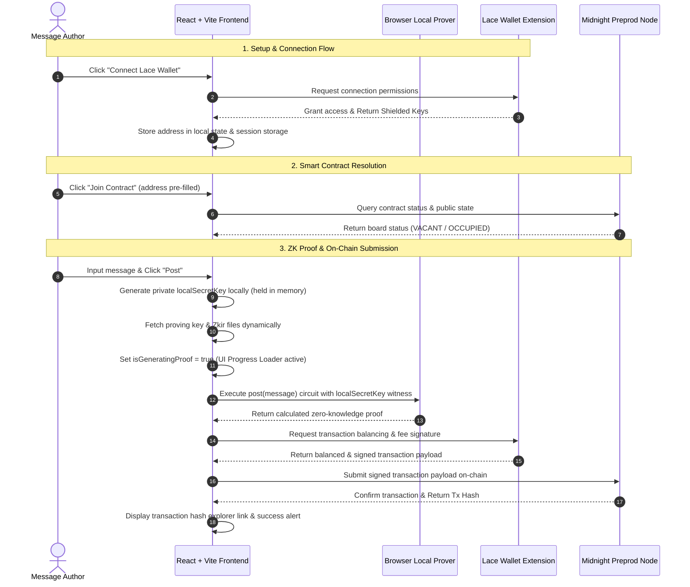

# Midnight Bulletin Board 

A premium, privacy-first bulletin board application built on the **Midnight Network** utilizing zero-knowledge proofs. Users can connect their **Lace Wallet** to post public messages on-chain, while privately proving ownership of their posts using a local browser ZK prover without exposing their secret keys or signatures.


---

## Initial Product Idea
The Midnight Bulletin Board is a decentralized, privacy-preserving messaging portal that allows organizations and developers to post announcements, security updates, or status alerts to a public ledger while keeping the publisher's real on-chain identity completely hidden. By utilizing local zero-knowledge proofs, the publisher can dynamically delete or manage their posts, proving ownership using a private secret key locally in the browser without ever disclosing their master wallet address or shielded key material, shielding authors from targeted tracking, tracking correlation, or censorship.

---

## Live Demo & Resources
- **Frontend Live URL**: [https://midnight-theta-two.vercel.app/](https://midnight-theta-two.vercel.app/)
- **Github Repo**: [https://github.com/sylvia-barick/midnight](https://github.com/sylvia-barick/midnight)
- **Demo Video**: [https://drive.google.com/drive/folders/1VdZkEbYkubP3RYzzeJVh_Utx4k1CCuij?usp=sharing](https://drive.google.com/drive/folders/1VdZkEbYkubP3RYzzeJVh_Utx4k1CCuij?usp=sharing)
- **Preprod Contract Address**: `0200dbf964f541e1950883f5b2f539b66fd6111e46ce8e6e9551fbdd180114d5dd5b`
- **Network**: `Midnight Preprod`

---

## Level 2 Compliance Checklist

| Level 2 Criteria | Status | Implementation Details |
| :--- | :--- | :--- |
| **Lace Wallet Connect** | **Satisfied** | Connects via browser extension checking version `4.x`. Displays shielded coin key address, network, and active status. |
| **Lace Wallet Disconnect** | **Satisfied** | Resets connected API, wipes active context state, and clears local browser session cache. |
| **Circuit Called from Frontend** | **Satisfied** | Directly executes `post` and `takeDown` ZK circuits on state transitions. |
| **Observable ZK Privacy** | **Satisfied** | Author proves ownership of the post using a private seed without publishing the `localSecretKey` on-chain. |
| **Midnight Preprod Deployment** | **Satisfied** | Active contract resides on Preprod. Pre-filled in the UI for seamless joining. |
| **Verifiable On-Chain Contract** | **Satisfied** | Fully deployed at `0200dbf964f541e1950883f5b2f539b66fd6111e46ce8e6e9551fbdd180114d5dd5b`. |
| **Commit History** | **Satisfied** | Contains **11 incremental commits** describing actual code work. |
| **Zero Mocking** | **Satisfied** | Bypasses all dummy handlers. Integrates directly with real Midnight SDK and browser Lace Wallet. |

---

## Workflow & System Architecture

The following Mermaid diagram visualizes the Level 2 Bulletin Board architecture, detailing how the frontend UI, local proving engine, Lace Wallet extension, and the Midnight Preprod blockchain interact during a circuit call:



---

## Privacy Model

### PUBLIC (What everyone can see)
- The smart contract address and verification keys.
- The state of the board (`VACANT` or `OCCUPIED`).
- The text content of the message when it is active.
- The owner's derived cryptographic identity (public key hash).
- The transaction hash submitting the state transitions.

### PRIVATE (What remains hidden)
- The user's wallet seed phrase and unshielded private keys.
- The `localSecretKey` that determines ownership of the posted message.
- The intermediate values and witnesses used during local ZK proof generation.

### User Proves
- The user proves: *"I know the private `localSecretKey` corresponding to the owner hash of the currently occupied board"* without revealing the `localSecretKey` itself.

---

## Privacy Claim

### What an on-chain observer CAN see:
- That a message was successfully posted or taken down.
- That the action was validated by a valid, locally-generated zero-knowledge proof.
- The cryptographic hash identifying the owner.

### What an on-chain observer CANNOT see:
- The private secret key of the message author.
- Any link linking the bulletin board post to the author's real shielded wallet address or coin public key.

---

## Tech Stack
- **Midnight Network**: Privacy-first Layer-1 blockchain.
- **Compact**: Smart contract programming language for zero-knowledge circuits.
- **Midnight.js SDK**: TypeScript library for contract deployment, proving, and ledger submission.
- **React + Vite**: Modern, responsive frontend application.
- **Lace Wallet**: Official browser extension wallet for token management and transaction signing.

---

## Prerequisites
- **Node.js**: `v22+` (tested with `v22.23.1`)
- **Lace Wallet**: Browser extension set to the **Preprod** network.
- **Docker**: Needed to run the local proof server.
- **Compact Compiler**: Compiler version `0.31.1`.

---

## Run Locally

### 1. Clone & Setup
```bash
# Clone the repository
git clone https://github.com/sylvia-barick/midnight.git
git checkout master

# Install dependencies for the monorepo
npm install
```

### 2. Compile the Smart Contract
Generate typescript bindings, zkir files, and proving keys using the Compact compiler:
```bash
cd contract

# Create the output directory
mkdir -p src/managed/bboard

# Compile contract and generate keys
compactc src/bboard.compact ./src/managed/bboard
zkir compile-many ./src/managed/bboard/zkir ./src/managed/bboard/keys

# Build TypeScript target
npm run build
cd ..
```

### 3. Build API and Frontend
```bash
# Build api bindings
cd api
npm run build
cd ..

# Build frontend UI assets
cd bboard-ui
npm run build
```

### 4. Run the Dev Server
```bash
# Start Vite development server
npm run dev
```

### 5. Deploying
To deploy the frontend to Vercel or Netlify:
```bash
# Build the UI
npm run build

# Deploy via Vercel CLI
vercel --prod
```
The workspace includes predefined `vercel.json` and `netlify.toml` files to handle route rewrites automatically.

---

## License
Licensed under the Apache License, Version 2.0. See [LICENSE](file:///LICENSE) for details.
