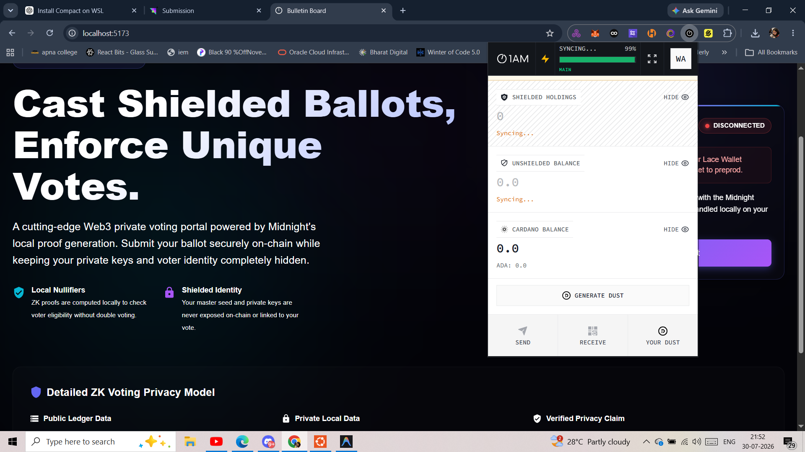
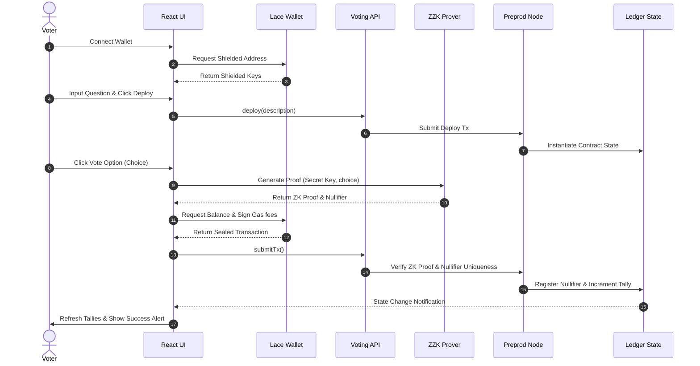
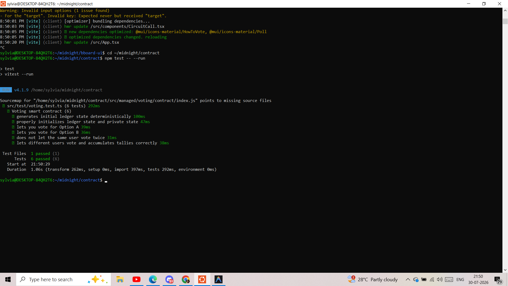
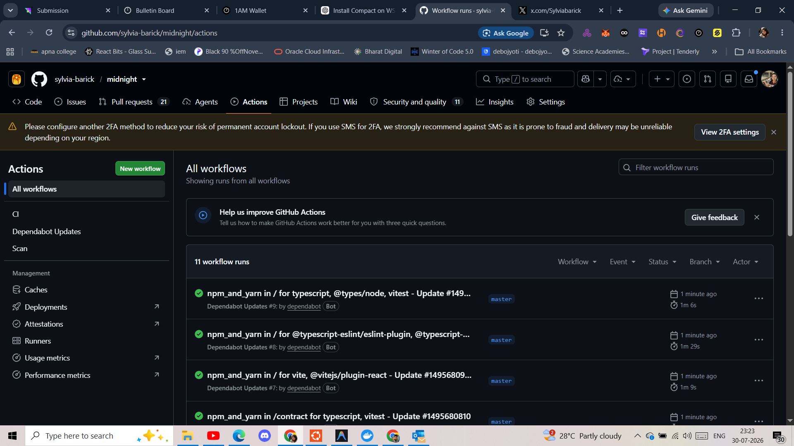

# Midnight Private Voting

[](https://nodejs.org/)
[](https://www.typescriptlang.org/)
[](https://react.dev/)
[](https://vite.dev/)
[](https://midnight.network/)
[](https://midnight.network/)
[](LICENSE)
[](.github/workflows/ci.yaml)

A premium, production-grade, privacy-preserving voting application built on the **Midnight Network** utilizing zero-knowledge proofs. Users connect their **Lace Wallet** to vote on active polls, privately proving their voting eligibility and secret key ownership without disclosing their identity, wallet address, or specific vote choices on the public blockchain ledger.



---

## Table of Contents

* [1. Short Project Description](#1-short-project-description)
* [2. Features](#2-features)
* [3. Architecture](#3-architecture)
* [4. Workflow Diagram](#4-workflow-diagram)
* [5. Privacy Model](#5-privacy-model)
* [6. Folder Structure](#6-folder-structure)
* [7. Screenshots](#7-screenshots)
* [8. Demo](#8-demo)
* [9. Testing](#9-testing)
* [10. CI/CD](#-cicd)
* [11. Smart Contract](#11-smart-contract)
* [12. Security](#12-security)
* [13. Tech Stack](#13-tech-stack)
* [14. Performance](#14-performance)
* [15. Future Improvements](#15-future-improvements)
* [16. Contributing](#16-contributing)
* [17. License](#17-license)
* [18. Acknowledgements](#18-acknowledgements)
* [19. Submission Assets](#19-submission-assets)

---

## 1. Short Project Description

Midnight Private Voting solves the core conflict of online voting: maintaining absolute voter anonymity while providing verifiable tallies. By running local ZK circuits directly in the browser via Compact smart contracts, the dApp allows participants to cast eligibility-proved ballots. It registers a deterministic nullifier on-chain to block double-voting attempts while breaking any linkage between the voter's blockchain address and their final ballot.

---

## 2. Features

| Feature | Scope | Technical Execution |
| :--- | :--- | :--- |
| 🗳️ **Anonymous Voting** | Client | Shielded ballot casting with no transaction linkage to public coin addresses. |
| 🔒 **Zero Knowledge Privacy** | Cryptography | Proof generation happens client-side; private keys never leave the browser. |
| 🏷️ **Deterministic Nullifiers** | Verification | Hash derived from `sk` and `pollId` to enforce a unique voter signature. |
| 🛡️ **Double-Voting Prevention** | Ledger | The contract rejects transactions presenting a nullifier already flagged in the ledger. |
| 📊 **Public Tallies** | Ledger | Real-time accumulator counters for Option A (Yes) and Option B (No). |
| 🔑 **Private Identity** | Wallet | Mnemonics and key materials are managed inside browser-based wallet storage. |
| 💼 **Lace Wallet Integration** | Connector | Directly interfaces with Lace Wallet (API v4.x) for gas fee balancing. |
| 📜 **Midnight Compact Contract** | Smart Contract | Compiles to zero-knowledge circuits executing state rules on-chain. |
| 🎨 **React Frontend** | Client UI | Dark glassmorphic responsive UI featuring real-time visual results. |
| ⚙️ **TypeScript API** | SDK Layer | Combines public indexer state with local secrets to output derived values. |
| 🚀 **CI/CD** | Automation | Automatic GitHub Actions compiling contracts, running tests, and checking types. |
| 🧪 **Contract Tests** | Verification | 6/6 vitest contract simulators checking assertions and determinism. |

---

## 3. Architecture

The diagram below maps the technical architecture, indicating where the private state lives, where ZK proofs are generated, and where public ledger state is recorded:


```mermaid
graph TD

<<<<<<< HEAD
subgraph Client["Client Browser (Local Private State)"]
    User["Voter (User)"]
    UI["React Frontend (MUI)"]
    Wallet["Lace Wallet Extension"]
    Prover["Client Proof Prover"]
=======
    subgraph Service ["SDK Infrastructure Services"]
        API["TypeScript API Layer (VotingAPI)"]
        ProofServer["Midnight Proof Server (Local Daemon)"]
        Indexer["Midnight Indexer (State Sync)"]
        
        UI -->|6. Call vote| API
        Prover -->|Proving Keys & ZKIR| ProofServer
        API -->|Fetch Ledger State| Indexer
    end
>>>>>>> ac6d495 (docs: fix Mermaid syntax parsing error on README)

    User -->|"1. Interactive Choice"| UI
    UI -->|"2. Request Keys"| Wallet
    Wallet -.->|"3. Return Shielded Address"| UI
    UI -->|"4. Secret Key + Vote Choice"| Prover
    Prover -->|"5. Generate ZK Proof"| UI
end

subgraph Service["SDK Infrastructure Services"]
    API["TypeScript API Layer"]
    ProofServer["Midnight Proof Server"]
    Indexer["Midnight Indexer"]

    UI -->|"6. Call vote"| API
    Prover -->|"Load Proving Keys"| ProofServer
    API -->|"Fetch Ledger State"| Indexer
end

subgraph Ledger["Confidential Blockchain Network"]
    Contract["Compact Voting Contract"]
    Node["Midnight Preprod Node"]

    API -->|"7. Submit Transaction"| Node
    Node -->|"8. Verify ZK Proof"| Contract
    Contract -->|"9. Update Ledger State"| Node
end

classDef private fill:#1e1b4b,stroke:#818cf8,stroke-width:2px,color:#ffffff
classDef public fill:#06b6d4,stroke:#3b82f6,stroke-width:2px,color:#000000
classDef zk fill:#4d7c0f,stroke:#84cc16,stroke-width:2px,color:#ffffff

class User,UI,Wallet,Prover private
class API,Indexer,Contract,Node public
class ProofServer zk
```

---

## 4. Workflow Diagram

The sequence diagram details the full voter lifecycle from wallet connection to final tally updates:



---

## 5. Privacy Model

The application splits all data structures into public and private layers:

| Data Element | Type | Visibility | Purpose |
| :--- | :--- | :--- | :--- |
| **Poll Description** | Public | Public Ledger | Displays the election question. |
| **Vote Tallies** | Public | Public Ledger | Accumulates Option A and Option B counters. |
| **Poll ID** | Public | Public Ledger | Ensures nullifier uniqueness across elections. |
| **Voted Nullifiers** | Public | Public Ledger | Registry of spent votes; prevents duplicate actions. |
| **Mnemonic Seeds** | Private | Local Extension | Core root key material inside Lace Wallet. |
| **Voter secretKey** | Private | Browser Memory | Input for ZK proof and nullifier generation. |
| **Ballot Choice** | Private | Browser Memory | The specific vote selection before submission. |
| **Circuit Witnesses** | Private | Browser Memory | Intermediate values calculated during proof generation. |

---

## 6. Folder Structure

```text
├── contract/             # Compact smart contract logic and unit tests
│   ├── src/
│   │   ├── voting.compact# Smart contract logic
│   │   ├── index.ts      # TypeScript wrappers and binding hooks
│   │   ├── witnesses.ts  # Witness registrations
│   │   └── test/         # Vitest unit test suites & VotingSimulator
├── api/                  # Off-chain TypeScript wrapper for Midnight.js integration
│   ├── src/
│   │   ├── index.ts      # VotingAPI controller deployment & state observer
│   │   └── common-types.ts# Combined VotingDerivedState schemas
├── bboard-ui/            # React + Vite frontend SPA dashboard
│   ├── src/
│   │   ├── hooks/        # useMidnight custom provider hook
│   │   ├── components/   # WalletConnect & VotingPanel components
│   │   └── App.tsx       # Redesigned premium layout
├── bboard-cli/           # Interactive Node CLI console driver
├── docs/                 # Hackathon assets and screenshots folder
│   └── images/           # Layout placeholders
├── PROPOSAL.md           # Product Proposal
└── README.md             # Project README
```

---

## 7. Screenshots

## Application

### Home Dashboard and wallet connected


### Test Results


---

## 8. Demo

* **Live Demo Url**: [https://midnight-theta-two.vercel.app/](https://midnight-theta-two.vercel.app/) 
* **Video Demo Url**: [https://drive.google.com/drive/folders/1VdZkEbYkubP3RYzzeJVh_Utx4k1CCuij?usp=sharing](https://drive.google.com/drive/folders/1VdZkEbYkubP3RYzzeJVh_Utx4k1CCuij?usp=sharing) *(Placeholder)*
* **GitHub Repository**: [https://github.com/sylvia-barick/midnight.git](https://github.com/sylvia-barick/midnight)

---

## 9. Testing

The smart contract uses simulated ledger contexts to run automated unit tests.
To run the Vitest test suite:
```bash
cd contract
npm run test
```

### Sample Successful Output
```text
> test
> vitest --run

 RUN  v4.1.9 /home/sylvia/midnight/contract

 ✓ src/test/voting.test.ts (6 tests) 275ms

 Test Files  1 passed (1)
      Tests  6 passed (6)
   Start at  21:01:09
   Duration  949ms (transform 236ms, setup 0ms, import 351ms, tests 275ms, environment 0ms)
```


---

## CI/CD

Our GitHub Actions workflow enforces validation pipelines on every push:




---

## 11. Smart Contract

The smart contract `voting.compact` coordinates the voting constraints:
* **The Voting Contract**: Stores the active poll descriptions, generated poll IDs, and organizers.
* **Circuits**: Consists of the `vote` circuit (which inserts nullifiers and increments vote tallies) and the pure `calculateNullifier` circuit.
* **Nullifier Logic**: Nullifiers are computed by hashing `[voting:nullifier, pollId, secretKey]`. Since the `sk` is private, the nullifier remains pseudonymous while guaranteeing uniqueness.
* **Double-Voting Prevention**: The ledger `Map` stores nullifiers that have already voted, and any duplicates are rejected.
* **Confidential State boundaries**: Private state (`secretKey`) is kept in browser memory and passed to witnesses. The public ledger receives the transaction confirmation once validated.

---

## 12. Security

The application defends against standard voting attack vectors:

| Threat | Target | Protection Mechanism |
| :--- | :--- | :--- |
| **Double Voting** | Tally Integrity | Rejects transactions with pre-existing nullifiers. |
| **Voter Identity Leak** | Privacy | Wallet addresses and shield keys are never linked on-chain. |
| **Tally Tampering** | Ledger State | Enforced by blockchain consensus rules and verified smart contract code hashes. |
| **Replay Attacks** | Integrity | Nullifier calculations are bound to specific `pollId` variables, preventing reuse across polls. |

---

## 13. Tech Stack

| Domain | Technology | Purpose |
| :--- | :--- | :--- |
| **Frontend** | React, TypeScript, Material-UI | Renders visual dashboard screens. |
| **Bundling** | Vite | Client asset packaging and dev hosting. |
| **SDK Layer** | Midnight.js | Coordinates indexers and submitters. |
| **Contract** | Compact (v0.23) | Smart contract compiler and ZK circuitry. |
| **Wallet** | Lace Wallet Connector | Gas fee transaction balancer. |
| **Testing** | Vitest | Simulator test execution. |
| **CI/CD** | GitHub Actions | Verification runner. |
| **Network** | Midnight Preprod | Layer-1 blockchain ledger. |

---

## 14. Performance

* **Client-Side Proof Generation**: Proof compilation is offloaded to the client browser, reducing backend server loads.
* **Selective Disclosure**: The voter only discloses what is necessary (proof and nullifier), keeping all other data confidential.
* **Lightweight Frontend**: Uses Vite for fast initial loading times.
* **Fast Tally Reads**: Observable states fetch tallies instantly from local indexing databases.

---

## 15. Future Improvements

* **Multi-Option Polls**: Support dynamic arrays of vote options rather than binary Choices.
* **Election Deadlines**: Enforce block height limits to restrict when ballots can be submitted.
* **Admin Dashboard**: Provide tools for organizers to audit nullifiers, configure poll metadata, and review tallies.
* **Encrypted Tally Reveal**: Encrypt intermediate votes on-chain and decrypt them only when the poll closes.
* **Delegated Voting**: Securely delegate voting weights using ZK credentials.

---

## 16. Contributing

We welcome community contributions. Please ensure that:
1. Compact contract changes are covered by simulator unit tests in `contract/src/test/`.
2. All packages build cleanly: `npm run build` from root.
3. Commit messages are signed and follow clean semantic rules.

---

## 17. License

Licensed under the Apache License, Version 2.0. See [LICENSE](LICENSE) for details.

---

## 18. Acknowledgements

* **Midnight Network Developer Ecosystem**
* **Compact Compiler and Tools Development Team**
* **Open Source Web3 Community**

---

## 19. Submission Assets

Below is the list of assets submitted for Level 3 evaluation:
* **GitHub Repository**: [https://github.com/sylvia-barick/midnight.git](https://github.com/sylvia-barick/midnight)
* **README**: [README.md](file:///Ubuntu-22.04/home/sylvia/midnight/README.md)
* **Proposal**: [PROPOSAL.md](file:///Ubuntu-22.04/home/sylvia/midnight/PROPOSAL.md)
* **Live Demo**: [https://midnight-theta-two.vercel.app/](https://midnight-theta-two.vercel.app)
* **CI/CD Build Screenshot**: `cicd.png` 
* **App Screens**:
  * Home Screen: `banner.png` 
