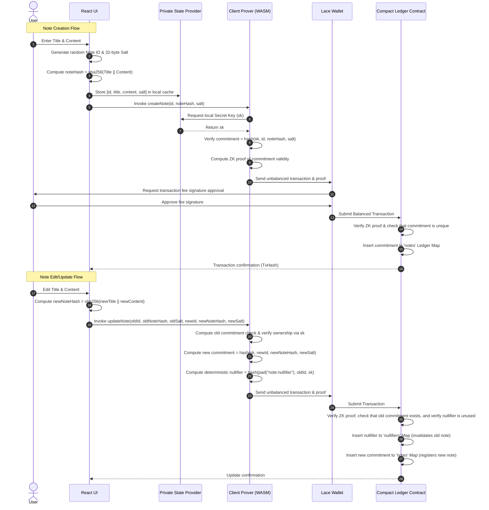
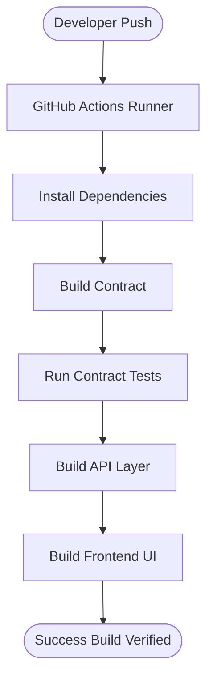

# Secret Notes DApp on Midnight Network

[](https://nodejs.org/)
[](https://www.typescriptlang.org/)
[](https://react.dev/)
[](https://vite.dev/)
[](https://midnight.network/)
[](https://midnight.network/)

Welcome to **Secret Notes**, a premium, production-grade, privacy-preserving private notes application built on the **Midnight Network** utilizing zero-knowledge (ZK) proofs. Secret Notes allows users to perform full CRUD operations (Create, Read, Update, Delete) on private notes. Note plaintexts, titles, and secret keys never leave the user's browser, while the blockchain secures cryptographic commitments to verify state transitions.

---

## 1. System Architecture

The Secret Notes DApp splits operations between **local client-side execution** (private state, proving) and **on-chain consensus verification** (public ledger state).

### Architecture Flowchart


```mermaid
<<<<<<< HEAD
graph TD

<<<<<<< HEAD
subgraph Client["Client Browser (Local Private State)"]
    User["Voter (User)"]
    UI["React Frontend (MUI)"]
    Wallet["Lace Wallet Extension"]
    Prover["Client Proof Prover"]
=======
    subgraph Service ["SDK Infrastructure Services"]
        API["TypeScript API Layer (VotingAPI)"]
        ProofServer["Midnight Proof Server (Local Daemon)"]
        Indexer["Midnight Indexer (State Sync)"]
=======
graph TB
    subgraph Client ["Client Browser (Local Private Boundary)"]
        UI["React Web Application"]
        Hook["useNotes & useMidnight Hooks"]
        StateProvider["In-Memory Private State Provider"]
        LocalStorage[("Browser LocalStorage (Encrypted plaintext cache)")]
        Prover["Midnight Client-Side Prover"]
        Wallet["Lace Wallet (dApp Connector API)"]
        
        UI <-->|UI state & lists| Hook
        Hook <-->|Read/Write Plaintext| StateProvider
        StateProvider <-->|Persist Salts & Plaintext| LocalStorage
        Hook -->|Request ZK Proof| Prover
        Prover -->|Generate ZK proof & contract bindings| Wallet
    end

    subgraph network ["Midnight Network Nodes (Preprod)"]
        Ledger["Compact Notes Smart Contract"]
        NotesMap[("notes Ledger Map (32-byte Commitments)")]
        NullifiersMap[("nullifiers Ledger Map (32-byte Nullifiers)")]
>>>>>>> d036a44 (modifiedd)
        
        Wallet -->|Broadcast unbalanced tx & proof| Ledger
        Ledger -->|Verify ZK proof & append commitment| NotesMap
        Ledger -->|Verify deterministic nullifier & mark spent| NullifiersMap
    end
>>>>>>> ac6d495 (docs: fix Mermaid syntax parsing error on README)

<<<<<<< HEAD
    User -->|"1. Interactive Choice"| UI
    UI -->|"2. Request Keys"| Wallet
    Wallet -.->|"3. Return Shielded Address"| UI
    UI -->|"4. Secret Key + Vote Choice"| Prover
    Prover -->|"5. Generate ZK Proof"| UI
end

subgraph Service["SDK Infrastructure Services"]
    API["TypeScript API Layer"]
    ProofServer["Midnight Proof Server"]
    Indexer["Midnight Indexer"]

    UI -->|"6. Call vote"| API
    Prover -->|"Load Proving Keys"| ProofServer
    API -->|"Fetch Ledger State"| Indexer
end

subgraph Ledger["Confidential Blockchain Network"]
    Contract["Compact Voting Contract"]
    Node["Midnight Preprod Node"]

    API -->|"7. Submit Transaction"| Node
    Node -->|"8. Verify ZK Proof"| Contract
    Contract -->|"9. Update Ledger State"| Node
end

classDef private fill:#1e1b4b,stroke:#818cf8,stroke-width:2px,color:#ffffff
classDef public fill:#06b6d4,stroke:#3b82f6,stroke-width:2px,color:#000000
classDef zk fill:#4d7c0f,stroke:#84cc16,stroke-width:2px,color:#ffffff

class User,UI,Wallet,Prover private
class API,Indexer,Contract,Node public
class ProofServer zk
=======
    subgraph Indexer ["Indexer Services"]
        Index["Midnight Indexer Node"]
        IndexSub["WebSocket State Stream"]
        
        Ledger -->|Publish Block Events| Index
        Index -->|Push State updates| IndexSub
        IndexSub -->|Observable State$ updates| Hook
    end
>>>>>>> d036a44 (modifiedd)
```

---

## 2. Architecture Details

The following table breaks down each component, its execution context, security boundary, and role:

| Component | Execution Context | Privacy Level | Data Handled | Function / Role |
| :--- | :--- | :--- | :--- | :--- |
| **React UI** | Browser (Client) | Private / Local | Note Plaintext, Titles, Salts, UI states | Interactive user panel for writing, editing, and viewing private notes. |
| **Private State Provider** | Browser (Memory) | Private / Local | Note Plaintext, Salts, Wallet Secret Keys (`sk`) | Orchestrates client-side encryption caches and handles localStorage synchronization. |
| **Midnight Prover** | Browser (Local WebAssembly) | Private / Local | Circuit private inputs, salts, keys | Computes local ZK proofs verifying that state transitions (e.g. note edits) follow the smart contract rules. |
| **Lace Wallet** | Extension (Sandbox) | Private / Secure Extension | UTXO balances, fees, transaction signatures | Prompts user signature popups, executes coin-balancing, and broadcasts the finalized ZK transaction. |
| **Compact Smart Contract** | Midnight Ledger | Public / On-Chain | ZK proofs, commitments, nullifiers | Enforces note ownership constraints, double-spending validation, and stores cryptographically hidden state logs. |
| **Midnight Indexer** | Public Service | Public Node | Transaction indices, block headers, state events | Scans blocks, parses public commitments and nullifiers, and pushes updates via WebSockets back to the UI. |

---

## 3. Data Schemas & ZK Equations

To enforce security without exposing note titles or text, the DApp maps private plaintexts to public ledger states using cryptographic hashing.

| State Name | Type | Location | Cryptographic Equation | Privacy Guarantee |
| :--- | :--- | :--- | :--- | :--- |
| **Note Hash** | `Bytes[32]` | Local Cache / Private Input | `noteHash = sha256(title || content)` | Observers cannot learn note titles or content due to one-way hash property. |
| **Note Salt** | `Bytes[32]` | Private State / Local Storage | `salt = random32Bytes()` | Prevents rainbow-table brute-forcing of short or predictable note content. |
| **Note Commitment** | `Bytes[32]` | On-Chain Ledger Map (`notes`) | `commitment = persistentHash([sk, id, noteHash, salt])` | Hides the note's identity and data, binding it to the owner's secret key (`sk`). |
| **Note Nullifier** | `Bytes[32]` | On-Chain Ledger Map (`nullifiers`) | `nullifier = persistentHash([pad("note:nullifier"), id, sk])` | Proves double-spending/edit authorization without linking back to the original commitment. |

---

## 4. State Transition Workflow

The sequence diagram below displays the operation flow when a user creates, edits, or deletes a private note:



---

## 5. ZK Smart Contract Constraints

The [notes.compact](file:///Ubuntu-22.04/home/sylvia/level2/contract/src/notes.compact) smart contract enforces the following zero-knowledge assertions during state execution:

1. **Ownership Constraint**: In `updateNote` and `deleteNote` circuits, the client must prove knowledge of the wallet secret key `sk` that matches the salt and hash of the original commitment.
2. **Double-Spend Prevention**: The contract checks the deterministic `nullifiers` ledger map. If the nullifier already exists, the transaction fails immediately.
3. **Commitment Integrity**: When creating or updating a note, the commitment must not exist on-chain beforehand. This prevents replays and overwrites.

---

## 6. Folder Structure

```text
├── contract/            # Compact smart contract circuits & unit tests
│   ├── src/
│   │   ├── notes.compact  # ZK circuits (create, read, update, delete)
│   │   ├── witnesses.ts   # Private state witnesses mapping
│   │   ├── index.ts       # Compiled contract exporter
│   │   └── test/          # Vitest suite using contract simulator
├── api/                 # TypeScript client API layer
│   ├── src/
│   │   ├── index.ts       # NotesAPI class (deploy, join, CRUD calls)
│   │   └── common-types.ts# Types mapping derived state
└── bboard-ui/           # React/Vite/MUI glassmorphism frontend application
    ├── src/
    │   ├── services/      # Wallet, Contract, Notes, Network services
    │   ├── hooks/         # useWallet, useNotes, useNetwork, useMidnight
    │   ├── components/    # Navbar, Footer, NoteCard, WalletCard, LoadingSpinner
    │   └── pages/         # Home, Dashboard, MyNotes, Deploy, About
```

---

## 7. Installation & Running

### Prerequisites

<<<<<<< HEAD
### Home Dashboard and wallet connected


### Test Results

=======
* Node.js `>= 24.11.1` (or managed via NVM)
* Midnight Compact Compiler (installed globally under WSL)

### Instructions

1. Clone the repository and install root dependencies:
   ```bash
   npm install
   ```

2. Build all workspaces (contract compiling, API types compilation, Vite UI bundling):
   ```bash
   npm run build
   ```

3. Launch the development server locally:
   ```bash
   npm run dev --workspace=@midnight-ntwrk/bboard-ui
   ```
>>>>>>> d036a44 (modifiedd)

---

## 8. Smart Contract Compilation

<<<<<<< HEAD
* **Live Demo Url**: [https://midnight-theta-two.vercel.app/](https://midnight-theta-two.vercel.app/) 
* **Video Demo Url**: [https://drive.google.com/drive/folders/1VdZkEbYkubP3RYzzeJVh_Utx4k1CCuij?usp=sharing](https://drive.google.com/drive/folders/1VdZkEbYkubP3RYzzeJVh_Utx4k1CCuij?usp=sharing) *(Placeholder)*
* **GitHub Repository**: [https://github.com/sylvia-barick/midnight.git](https://github.com/sylvia-barick/midnight)

---

## 9. Testing

The smart contract uses simulated ledger contexts to run automated unit tests.
To run the Vitest test suite:
=======
To compile `notes.compact` into TypeScript interfaces and generate ZKIR keys, execute inside the `contract` folder:
```bash
npm run compact
```

To run the ZK contract simulator unit tests:
>>>>>>> d036a44 (modifiedd)
```bash
npm run test
```

---

## 9. Deployment Guide

<<<<<<< HEAD
 ✓ src/test/voting.test.ts (6 tests) 275ms

 Test Files  1 passed (1)
      Tests  6 passed (6)
   Start at  21:01:09
   Duration  949ms (transform 236ms, setup 0ms, import 351ms, tests 275ms, environment 0ms)
```

=======
To deploy the smart contract to Midnight Preprod:
1. Ensure your browser is running the Lace Wallet extension set to Preprod network.
2. Navigate to the **Deploy Contract** tab in the UI.
3. Click **Deploy Compact Notes Contract**.
4. Approve the gas fee balancing request in the Lace Wallet pop-up.
5. The deployed contract address will be displayed and automatically saved to your browser session.
>>>>>>> d036a44 (modifiedd)

---

## 10. Wallet Setup

<<<<<<< HEAD
Our GitHub Actions workflow enforces validation pipelines on every push:



=======
1. Install the official **Midnight Lace Wallet** or **1AM Wallet** extension in your browser.
2. Select the **Midnight Preprod** network configuration.
3. Fund your wallet address with Preprod tADA/tDUSK test tokens from the official faucet.
4. Click **Connect Wallet** in the application navbar or home screen.
>>>>>>> d036a44 (modifiedd)

---

## 11. Preprod Environment

To check transaction confirmation statuses or view block operations, use the Midnight Preprod Network Indexer:
* **Preprod Indexer**: `https://indexer.preprod.midnight.network`
* **Proof Prover Service**: `http://localhost:6300` (or the RPC prover configured in your Lace wallet)

---

## 12. Screenshots & Demo Placeholders

### Application Screenshots

* **Home Screen**: *[Placeholder: screenshots/home.png]*
* **Dashboard Overview**: *[Placeholder: screenshots/dashboard.png]*
* **Notes Workspace**: *[Placeholder: screenshots/notes.png]*

### Project Demo Video

* **Video Walkthrough**: *[Placeholder: media/demo_walkthrough.mp4]*

---

## Contract Address

* **Preprod Contract Address**: `0200dbf964f541e1950883f5b2f539b66fd6111e46ce8e6e9551fbdd180114d5dd5b`
* **Network**: `Midnight Preprod`

<<<<<<< HEAD
---

## 14. Performance

* **Client-Side Proof Generation**: Proof compilation is offloaded to the client browser, reducing backend server loads.
* **Selective Disclosure**: The voter only discloses what is necessary (proof and nullifier), keeping all other data confidential.
* **Lightweight Frontend**: Uses Vite for fast initial loading times.
* **Fast Tally Reads**: Observable states fetch tallies instantly from local indexing databases.

---

## 15. Future Improvements

* **Multi-Option Polls**: Support dynamic arrays of vote options rather than binary Choices.
* **Election Deadlines**: Enforce block height limits to restrict when ballots can be submitted.
* **Admin Dashboard**: Provide tools for organizers to audit nullifiers, configure poll metadata, and review tallies.
* **Encrypted Tally Reveal**: Encrypt intermediate votes on-chain and decrypt them only when the poll closes.
* **Delegated Voting**: Securely delegate voting weights using ZK credentials.

---

## 16. Contributing

We welcome community contributions. Please ensure that:
1. Compact contract changes are covered by simulator unit tests in `contract/src/test/`.
2. All packages build cleanly: `npm run build` from root.
3. Commit messages are signed and follow clean semantic rules.

---

## 17. License

Licensed under the Apache License, Version 2.0. See [LICENSE](LICENSE) for details.

---

## 18. Acknowledgements

* **Midnight Network Developer Ecosystem**
* **Compact Compiler and Tools Development Team**
* **Open Source Web3 Community**

---

## 19. Submission Assets

Below is the list of assets submitted for Level 3 evaluation:
* **GitHub Repository**: [https://github.com/sylvia-barick/midnight.git](https://github.com/sylvia-barick/midnight)
* **README**: [README.md](file:///Ubuntu-22.04/home/sylvia/midnight/README.md)
* **Proposal**: [PROPOSAL.md](file:///Ubuntu-22.04/home/sylvia/midnight/PROPOSAL.md)
* **Live Demo**: [https://midnight-theta-two.vercel.app/](https://midnight-theta-two.vercel.app)
* **CI/CD Build Screenshot**: `cicd.png` 
* **App Screens**:
  * Home Screen: `banner.png` 
=======
>>>>>>> d036a44 (modifiedd)
